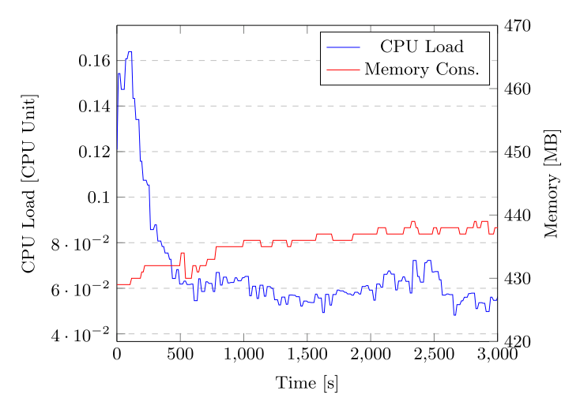

# 02 Dataset Publication

- Issuing around 13 datasets per minute for 1 hour, totalling 815 datasets
```
$ cd locust
$ locust
```

## Result

- `main.py validate chain -c 30` Results in dataset_count.txt
- Raw CPU load retrieved via OpenShift API: cpu.json
- Raw memory use retrieved via OpenShift API: memory.json
- Combined CPU and memory in results.csv

