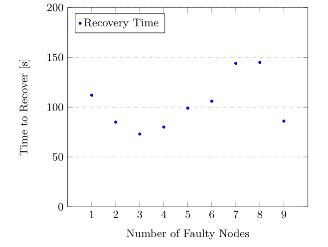

# 04 Faulty Nodes and Failing Primary

- Deliberately created faulty nodes (9 of our 30 nodes)
```
$ cd odbl
$ main.py deploy manage -o deactivate -n [NODES]
$ main.py deploy manage -o activate -n [NODES]
$ main.py validate chain -c 30
```  

## Result

- Results in recover_time.csv


